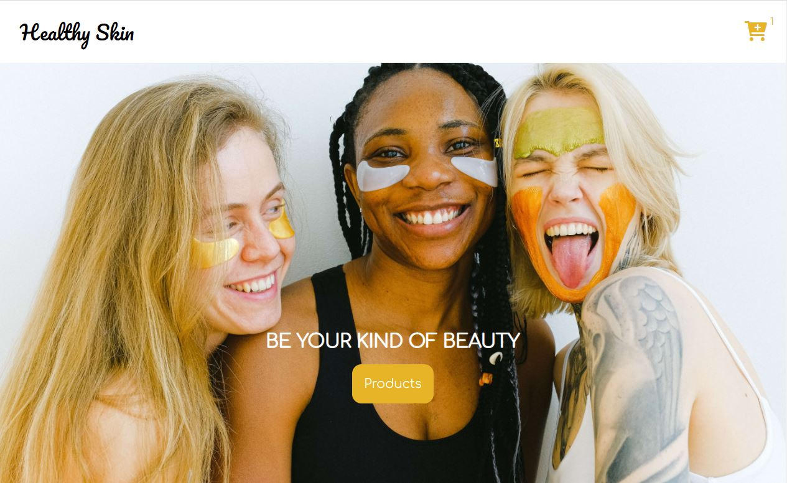

# Healthy Skin e-commerce site

## About project

This is a e-commerce store for cosmetics company made with only front-end features.

Shopping cart logic is written with support of Coding Addict (John Smilga) tutorial whose video was uploaded on freeCodeCamp.org channel.

I have added maximum item amount in cart ( max to 25 items per product) together with alert message when limit is reached.

### Built with

- Semantic HTML5
- CSS
- GSAP
- Vanilla JavaScript

### Links

Coding Addict's tutorial: https://www.youtube.com/watch?v=023Psne_-_4&ab_channel=freeCodeCamp.org

### Future plansfor this project

I will be adding new features to this project: blog site, about us page and others.
